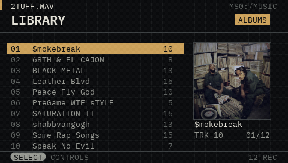
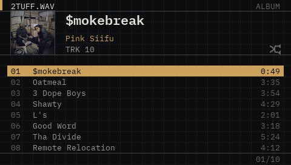
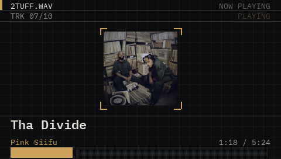
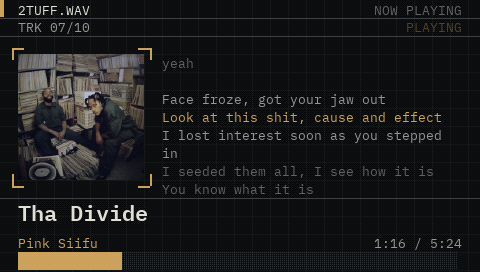
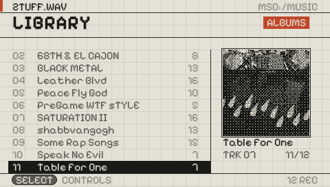
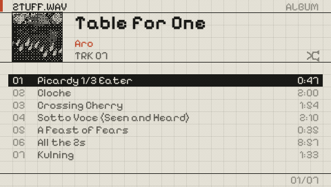

# 2Tuff.wav

A homebrew music player for the PSP.
yes,it's called `.wav` but it plays MP3s. so chill out.

## Screenshots








This repo is the source. If you just want to run it, grab the prebuilt
`EBOOT.PBP` (or build it yourself).

## BIG AHH NOTE: 
This is far from finished and under active development. 
It's upward compatible and tested on PSP 1000, 2000, and 3000 — the Street and Go wasn't tested but should work fine.
I'm still figuring out the next steps, so any feedback or suggestions would be appreciated. 
#KeepCreating

## requirments

- A PSP that can run homebrew. That means custom firmware, or one of the
  permanent/temporary CFW setups (I tested it on ARK-4/5). A stock PSP won't launch it.
- Some MP3s. This is important: it only plays **MP3**. The PSP has a dedicated
  hardware MP3 decoder and that's what the whole audio path is wired to, so WAV,
  FLAC, OGG, etc. won't work. If your files are something else, convert them
  first.
- That's about it. No network, no extra plugins.

## INSTALLATION

1. Copy the `2TUFFwav` folder into `PSP/GAME/` on your Memory Stick. You want to
   end up with:

   ```
   ms0:/PSP/GAME/2TUFFwav/EBOOT.PBP
   ```

   If you're on a PSP Go running from internal storage it's `ef0:` instead of
   `ms0:`. 'UNTESTED'**

2. Put your music under `ms0:/MUSIC/`.
   How you lay it out is up to you, and the app figures out the rest on launch
   ***NOTE: there is no reording items feature. the app orders tracks as they is in ms0:/MUSIC/
   || you can reorder your own folder by adding 001,002,...00n before the track name as it will be hidden when displayed on the hardware

   scanning mechanism:
   - one folder per album, or
   - `.m3u` / `.m3u8` / `.pls` playlist files, or
   - just dump loose `.mp3` files in there and theyll show up under `UNSORTED`.

   You can mix all three.

3. Launch **2TUFF.wav** from the PSP's Game menu.

Your settings (theme, font, cover style) get written to a `settings.cfg` file
right next to the EBOOT, so they stick around between launches. If you ever want
to reset them, just delete that file.

### Optional extras

**COVER ART** 
  Drop a JPEG named `cover.jpg`, `folder.jpg`, `front.jpg` or
  `albumart.jpg` into an album folder and it'll get picked up. If there isn't
  one, the app falls back to the artwork embedded in the first track's ID3 tag,
  and if there's none of that either it draws a generated placeholder. Note it
  only reads **JPEG** covers (embedded PNG art is ignored).


**SYNCED LYRICS** 
  Put an `.lrc` file next to a track with the same base name
  (`song.mp3` -> `song.lrc`) and the lyrics will scroll on the Now Playing
  screen, highlighting the current line. Standard `[mm:ss.xx]` timestamps, and
  an `[offset:...]` tag is honored if it's there.

## Controls

**Library**
- Up / Down to move, Left / Right to jump a page
- Square switches between Albums and Playlists
- Cross (X) opens the highlighted album/playlist
- Triangle opens Settings, Select opens the Controls reference

**Track list**
- Circle goes back
- L + Square toggles Shuffle

**Now Playing**
- x or Start: play / pause
- Right / Left: skim forward/back through the track. Cross also cancels a skim that's in progress.
- L: replay from the start. Tap L twice quickly to go to the previous track.
- R: next track (a random one if Shuffle is on)
- Triangle: show/hide lyrics
- Circle: back to the track list

## Building it yourself

You'll need the **PSPSDK / pspdev** toolchain on your `PATH`. The build calls
out to `psp-gcc`, `psp-config`, `mksfoex`, `pack-pbp`, `psp-fixup-imports` and
`psp-strip`, so if those aren't there it won't get far. You also need the
**libjpeg** portlib installed in the SDK, since cover decoding links against
`-ljpeg`.

you can grab pspdev from 
[github.com/pspdev/pspdev](https://github.com/pspdev/pspdev) 

There are two ways to build, they produce the same thing:

**With make:**

```
make
```

That uses the standard PSPSDK `build.mak` rules and spits out `EBOOT.PBP` in the
project root.

**With the script (Linux / WSL):**

```
./build.sh
```

This one compiles everything in `src/`, links, runs `psp-fixup-imports`, strips,
n packs the `EBOOT.PBP`. it also drops a copy into
`dist/PSP/GAME/2TUFFwav/` so you can copy that whole `PSP` folder straight to a
Memory Stick.

One heads up about `build.sh`: on a fresh Linux box, `psp-gcc` sometimes needs
`libmpc3` on the host and it isnt always installed. The script tries to grab
the `.deb` and unpack it into `~/pspdev-extra` without needing sudo. if that
download fails itll just tell you to `apt-get install libmpc3` and carry on. If
you're not on Debian/Ubuntu you can ignore that bit, it kinda dont matter.

Both build paths pack the XMB icon and background from `assets/ICON0.PNG` and
`assets/PIC1.PNG`.

## How it works

If you want to actually read the code, here's the lay of the land. None of this
is exotic, but a few parts are fiddly enough to be worth explaining.

### Boot and the main loop

`main.c` is the entry point. It registers the usual PSP exit callback, clocks
the CPU up to 333 MHz (the default 222 is slower than it needs to be), sets up
the controller, then brings up the subsystems in order: graphics, fonts, audio,
config, and a library scan.

After that it's a plain game loop running at vblank, so ~60 fps. Every frame it:
reads the pad and works out which buttons were *just* pressed this frame
(`g_pressed = held & ~previous`, classic edge detection), advances a time
counter, checks whether the current track finished and needs to auto-advance,
and then draws whichever of the three screens is active. There's no event
system, it's just "read input, update, draw" every frame, which keeps the state
easy to follow.

The app state all lives in one big `App` struct (`g_app`) — current screen,
selection indices, the loaded library, which textures are live, animation
timers, shuffle flag, and so on. Screens are an enum and there's a `switch` in
the loop. That's the whole "state machine."

### Drawing

`gfx.c` wraps the PSP's GU (the graphics hardware). Setup is standard: two
32-bit framebuffers with a 512-pixel stride for a 480x272 display, alpha
blending on, a display list of 256K words. Depth testing is actually off because
everything's 2D and drawn back to front.

Drawing is immediate-mode and a bit retro: every quad or textured sprite grabs a
few vertices from `sceGuGetMemory` (scratch memory that's only valid for the
current frame) and fires off a `sceGuDrawArray`. So there are no persistent
vertex buffers to manage; you just call `gfx_quad(...)` wherever you want a
rectangle. `dt` is measured from the system clock each frame and clamped, so the
animations stay smooth-ish even if a frame runs long.

The grid-paper background you see everywhere is literally drawn as a wash of
1-pixel lines every `GRID` pixels. A lot of the layout constants are expressed
in grid cells (`GX(n)`, `GY(n)`) so things line up on that grid.

### The audio thread

This is the part that took the most care, so it's in its own file (`audio.c`).

Decoding and playback happen on a **separate worker thread**, not the main loop.
The main thread never touches the MP3 decoder directly; instead it posts
requests (play this file / stop / pause / resume) into a few shared variables
that are guarded by a semaphore. The worker picks them up and acts on them. This
keeps audio from stuttering when the UI is busy loading a cover or scanning, and
it means seeking/pausing is just "set a flag" from the UI's point of view.

The actual playback (`play_file`) does the dance the PSP's `sceMp3` API wants:

- Open the file, peek at the ID3v2 header to find where the real audio stream
  starts (so we skip the tag), and note where it ends.
- Reserve an MP3 handle and prime it with the first chunk of data.
- Then loop: whenever `sceMp3CheckStreamDataNeeded` says it's hungry, read more
  bytes from the file into the spot it asks for; call `sceMp3Decode` to get a
  block of PCM back; and push that PCM out with `sceAudioSRCOutputBlocking`.
- The output channel is reserved on the fly to match the file's sample rate and
  the number of samples per call, so it handles 44.1k/48k/etc. without fuss.

Buffers are small (16 KB for the compressed input, ~9 KB for PCM) because the
decode loop refills constantly. Elapsed time is tracked by counting samples
played rather than trusting the clock, which keeps the progress meter honest.

Seeking converts a target millisecond into an MP3 frame number and calls
`sceMp3ResetPlayPositionByFrame`. The "skim" feature on Now Playing just nudges
a target time forward/back every frame and re-seeks on a throttle, which is why
you can hear it scrub.

When a track hits EOF the worker sets a `finished` flag. The main loop notices
that in `handle_auto_advance` and rolls on to the next track (or a random one if
shuffle's on). That's the only way the two threads talk about end-of-track, so
there's no callback tangle.

### How it scans your music

`library.c` walks `ms0:/MUSIC/` once at startup. The rules are simple:

- A **sub-folder** is treated as one record. It collects the `.mp3` files inside
  and looks for a cover image.
- An `.m3u` / `.m3u8` / `.pls` file becomes a **playlist** record. It parses the
  entries (handling `#EXTINF` titles for M3U and `File=`/`Title=` lines for PLS),
  and resolves relative paths against the playlist's own folder.
- Any **loose `.mp3`** sitting directly in `MUSIC/` gets lumped into a single
  record called `UNSORTED`.

The "album vs. playlist" split is the one slightly clever bit. After a folder is
collected, it peeks at the ID3 album tag of up to the first 16 tracks. If they
all share the same album, it's filed as an **Album**. If they disagree, it's
treated as a **Playlist** instead (a folder of random singles, basically). So
the Albums/Playlists toggle in the UI reflects what your tags actually say, not
just whether something was a folder or a `.m3u`.

Cover art inside a folder is chosen by a small ranking: a file starting with
`cover` beats `folder`, which beats `front`/`albumart`. Records get sorted by
name and tracks by filename, both case-insensitive.

To keep the initial scan fast, full per-track metadata (artist, durations,
proper titles) is **not** read up front. That happens lazily the moment you open
a record — `record_load_metadata` reads each track's tags then, sets the album
artist (or "VARIOUS ARTISTS" if they differ), grabs the year, and estimates
durations. Until then the list just shows filenames.

### Reading tags

`id3.c` is a from-scratch ID3 reader. It handles ID3v2.2, 2.3 and 2.4 (they
differ in frame-ID length and how the size field is encoded — 2.4 uses
"syncsafe" integers, which is a recurring gotcha), and falls back to the old
128-byte ID3v1 trailer at the end of the file if a v2 tag didn't supply
something. Text frames are decoded from Latin-1 or UTF-16 (with or without a
BOM), and anything non-ASCII gets squashed to `?` because the bitmap fonts only
cover ASCII anyway.

Embedded cover art (the `APIC`/`PIC` frame) is handled a bit carefully: rather
than copying the image bytes into the tag struct, it just records the **offset
and length** of the JPEG inside the file. Later, when a cover is actually needed,
the caller `fseek`s to that spot and reads it. That avoids holding a big image
blob in memory for every track during a scan.

Track durations come from `mp3meta.c`. It scans the first 64 KB past the ID3
tag for a valid MPEG frame header, and if that frame carries a Xing/Info or VBRI
header (the things VBR encoders write) it reads the exact frame count and
computes the length from that. If there's no VBR header it falls back to
estimating from the bitrate and file size. Not perfect for weird VBR files, but
close enough for a progress bar.

### Cover art and the dithering

`image.c` decodes JPEGs with libjpeg. It uses libjpeg's built-in downscaling
(picking a `scale_denom` so the decode lands near the size we need instead of
decoding a huge image and shrinking it), then box-filters the result down to a
square, center-cropped.

The signature 1-bit look comes from an 8x8 **Bayer ordered dither**. For each
pixel it computes luminance, compares it against the Bayer threshold matrix for
that pixel position, and snaps it to either the theme's "ink" color or
transparent. The dark theme inverts the comparison so covers read correctly on a
black background. Turn the dither off in Settings and you get the original color
JPEG instead.

If a record has no art at all, `image_make_placeholder` draws a procedural
pattern of concentric rings, seeded from a hash of the record name so each one
looks a little different. It gets dithered too, so placeholders match the rest of
the UI.

Textures are padded up to power-of-two dimensions because the GU wants that.

### Fonts and text

There are no TrueType files at runtime. `font_plex.h` holds the glyph **bitmaps
baked into a C array** — two faces (IBM Plex Mono, which is monospaced, and
Pixelify Sans, which is proportional and so ships per-glyph advance widths) at
two sizes each. At startup `text.c` turns those coverage arrays into texture
atlases (16 columns x 8 rows of ASCII) and from then on text is drawn as a batch
of `GU_SPRITES`, one quad per character. There are helpers for centered and
right-aligned text and a `text_put_clip` that truncates with an ellipsis when a
string won't fit.

### Themes, settings, lyrics

`theme.c` is just two color palettes ("paper" light and "terminal" dark) as a
struct of colors, with a global pointer you can flip. `config.c` reads and writes
the tiny `settings.cfg` (plain `key=value` lines for theme/font/cover) next to
the EBOOT; it figures out that path from `argv[0]`. `lyrics.c` parses `.lrc`
files into timestamped lines, strips inline `<...>` word tags, sorts by time, and
uses a binary search to find which line is active for the current playback
position.

### The screens

The three UI files (`ui_library.c`, `ui_record.c`, `ui_nowplaying.c`) are mostly
layout and input handling, with `widgets.c` providing the reusable pieces (rules,
the block-character progress meter, chips, key/value rows) and `controls.c`
drawing the PSP face/d-pad buttons procedurally rather than from images. The
animations (the cover flying into the viewfinder on Now Playing, the Settings and
Controls drawers sliding in, the lyrics panel) are all just timers eased with a
`smoothstep` and driven by `dt`.

## Project layout

```
src/        all the C source and headers (see "How it works" for what's what)
assets/     ICON0.PNG (XMB icon) and PIC1.PNG (XMB background)
licenses/   SIL OFL text for the two bundled fonts
Makefile    build via the standard PSPSDK rules
build.sh    build via a plain shell script (Linux/WSL)
```

## Known limitations 

- MP3 only, as mentioned. That's a hardware-decoder thing.
- Only JPEG cover art is read; PNG covers (loose or embedded) are skipped.
- Text rendering is ASCII-only, so non-Latin tags show up with `?` in place of
  characters the fonts don't have.
- VBR duration is estimated when there's no Xing/VBRI header, so a few odd files
  may show a slightly-off total time.
- The whole `ms0:/MUSIC/` tree is scanned at every launch. On a huge library
  that's a moment of waiting on startup.
